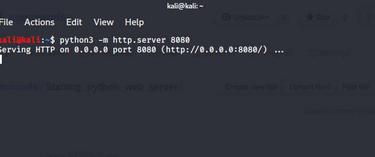

# Simple python server

I know installing and setting up apache2 webserver is bit hectic.

Now with python3, the setting a python web server is very simple.



```
-m : module
8080 : its the port, but can be any other port.
```

